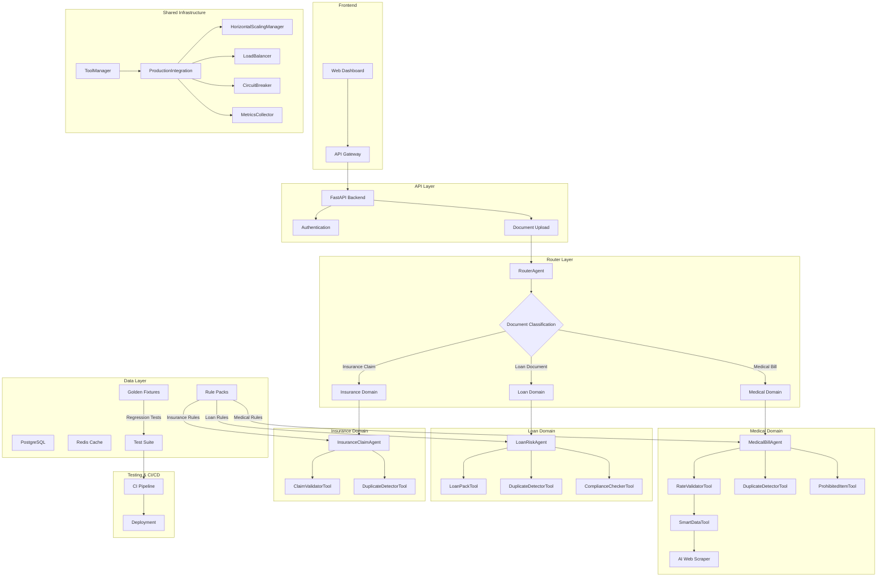

# VivaranAI Multi-Vertical Architecture

## System Architecture Diagram

## Multi-Vertical Pack-Driven Architecture

The VivaranAI system implements a sophisticated multi-vertical, pack-driven architecture that enables seamless analysis across different document domains:

### Key Components

1. **RouterAgent**: Central intelligence that:
   - Performs document classification
   - Routes documents to appropriate domain agents
   - Orchestrates cross-vertical workflows
   - Maintains health checks and agent registry

2. **Domain Agents**:
   - **MedicalBillAgent**: Specialized for medical bill analysis
   - **LoanRiskAgent**: Handles loan application risk assessment
   - **InsuranceClaimAgent**: Processes insurance claims

3. **Rule Packs**:
   - Domain-specific rule collections in YAML format
   - Centralized validation logic separate from agent code
   - Versioned and easily updatable without code changes

4. **Shared Infrastructure**:
   - **ToolManager**: Centralized tool registration and management
   - **ProductionIntegration**: Coordinates horizontal scaling and load balancing
   - **HorizontalScalingManager**: Manages tool instance pools
   - **LoadBalancer**: Intelligent request routing with health awareness

5. **Testing Framework**:
   - Golden fixtures for regression testing
   - Parametrized pytest cases
   - CI recall checks for production readiness

### Data Flow

1. Document is uploaded through the API
2. RouterAgent classifies the document type
3. Document is routed to the appropriate domain agent
4. Domain agent loads relevant rule packs
5. Analysis is performed using domain-specific tools
6. Results are returned to the user

### Cross-Vertical Workflows

The system supports complex workflows that span multiple domains:

1. RouterAgent orchestrates the workflow
2. Steps can be sequential or parallel
3. Data can flow between different domain agents
4. Results are aggregated and returned to the user

### Production Infrastructure

- Horizontal scaling for high-demand tools
- Health-aware load balancing
- Circuit breakers for resilience
- Comprehensive metrics collection
- Automated testing and deployment
